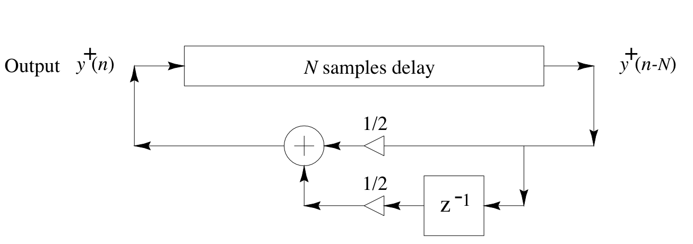

# The Wave Equation

In the previous notebook, we explored the dynamics of a system of interconnected undamped oscillators in 1D. Each of these oscillators was connected to its neighbors by springs. When considering an individual simple harmonic oscillator, the restoring force was directly proportional to the displacement of the oscillator from its equilibrium position. However, in the context of our chain of oscillators, the restoring force becomes proportional to the difference in displacement between neighboring oscillators. Thus, for a single oscillator in the chain, the equation becomes:

$$
m \ddot{x} = -k \Delta x,
$$

where $\Delta x$ represents the difference in displacement between the oscillator and its neighbors.
As the spacing between oscillators approaches zero, this difference approaches the second spatial derivative of $x$, leading us to the wave equation:

$$
\ddot{x} = c^2 \frac{\partial^2 x}{\partial x^2}
$$

where $c^2 = \frac{k}{m}$ is the wave speed.

We have just seen a way of using modal analysis and gradient descent to find an efficient method of synthesis. However, there are many other approaches to synthesizing sound from the wave equation. In this section, we'll take a look at how gradient descent can be applied to the inverse problem. This is similar to a previous chapter, where we looked at fitting the control parameters of an abstract, spectrally-motivated additive synthesizer to reproduce a saxophone sound. Here, we will apply motivate a physical sound synthesis model from the wave equation, and then use gradient descent to find the parameters of the model that best fit a given sound.

In particular we will focus on digital waveguide synthesis (DWG). DWGs are based on D'Alembert's [travelling wave solution](https://en.wikipedia.org/wiki/D%27Alembert%27s_formula) to the wave equation, where the solution is given by waves travelling on opposite directions:

$$
u(x, t) = F(x + ct) + G(x - ct)
$$

here $F(x + ct)$ represents a wave traveling to the left and $G(x - ct)$ represents a wave traveling to the right.

In DWGs, the propagation of the traveling waves is simulated using delay lines. At each sample step, losses occur, but if the loss is a linear operation, it can be commuted out of the individual samples and be applied cumulatively to the output of the delay line. 

The model of the loss should be frequency-dependent. With the simplest possible loss filter, we obtain a simulation diagram that looks like this:

This might look familiar as the basic structure of the Karplus-Strong algorithm for plucked string synthesis. In fact, the Karplus-Strong algorithm can be seen as a simple DWG. We'll look at applying the same methods as before to find the parameters of this model that best fit a given sound using gradient descent.

