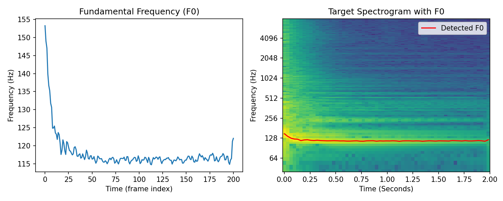

# Harmonic Synthesis Results

Let's see some more sound match examples with our differentiable harmonic synthesizer.

## Crepe Pitch Extraction
The Crepe pitch extraction algorithm {cite:p}`kim2018crepe` was used in the original work by {cite:p}`engel_ddsp_2020` and provides a more accurate and richer fundamental frequency envelope. This can help improve the final results of synthesis.

Crepe can be installed from [PyPi](https://pypi.org/project/crepe/). We replaced `functional.detect_pitch_frequency` with `crepe.predict` to produce the examples in these book.

The code for that is:
```python
frame_ms = 10.0
_, f0, _, _ = crepe.predict(
    audio.numpy()[0], sample_rate, step_size=frame_ms, viterbi=True
)
f0 = torch.from_numpy(f0).unsqueeze(0)
```

**Comparison of fundamental frequency envelopes**
</img>

## Saxophone
### Target
</img>

<audio controls>
    <source src="../_static/audio/reed_acoustic_target.wav" type="audio/wav">
</audio>

### Result
<video width="100%" src="../_static/videos/sax-ddsp-torchaudio.mp4" controls loop></video>
<audio controls>
    <source src="../_static/audio/reed_acoustic_result.wav" type="audio/wav">
</audio>

## Guitar
### Target
</img>

<audio controls>
    <source src="../_static/audio/guitar_acoustic_target.wav" type="audio/wav">
</audio>

### Result
<video width="100%" src="../_static/videos/guitar-ddsp-torchaudio.mp4" controls loop></video>
<audio controls>
    <source src="../_static/audio/guitar_acoustic_result.wav" type="audio/wav">
</audio>

## Challenges: Onsets and Transients

If you listen to the very beginning of the synthesized results, especially in the guitar, you'll hear that it is
missing the sharp pluck. The onset has been smoothed out by our harmonic synthesizer.
The onset, or **transient**, portion of a signal is defined by abrupt changes in amplitude, phase, or frequency information.
Sinusoidal/harmonic synthesis does not work well for these signal
components. Transient modelling has been a topic of recent research in DDSP synthesis
focused on sound effect modelling {cite:p}`barahona2023noisebandnet`{cite:p}`liu2023ddsp` and drum synthesis {cite:p}`shier2023differentiable`.

## Violin
### Target
</img>

<audio controls>
    <source src="../_static/audio/string_acoustic_target.wav" type="audio/wav">
</audio>

### Result
<video width="100%" src="../_static/videos/string-ddsp-torchaudio.mp4" controls loop></video>
<audio controls>
    <source src="../_static/audio/string_acoustic_result.wav" type="audio/wav">
</audio>

## Voice
### Target
</img>

<audio controls>
    <source src="../_static/audio/vocal_target.wav" type="audio/wav">
</audio>

### Result
<video width="100%" src="../_static/videos/vocal-ddsp-torchaudio.mp4" controls loop></video>
<audio controls>
    <source src="../_static/audio/vocal_result.wav" type="audio/wav">
</audio>

## Challenges: Noise, Room Sounds, Chorusing

In the violin and voice synthesis results, we can hear some choppiness and distortion.
Inspecting the spectrograms of the targets we can see that there is significant signal
energy in between the prominent harmonics. We can attribute these signal components to a
number of factors. In the violin there is extra noise produced from the bow string. There
is also room reverbation present in both these signals that cause a spectral smearing effect.

We can hear distortion in the synthesized signal, which may be created by the optimizer in an
attempt to minimize the error from these noisy/reverberant signal components with respect to the multi-resolution
spectral loss. Both noise and room reverberation were addressed by {cite:t}`engel_ddsp_2020`
through the introduction of specialized DDSP modules.

We can also hear in the voice sample that there may be more than one voice present, creating
a chorus-effect, which are slight pitch deviations between the different voices. This is 
more challenging phenomenon to reproduce. We could try to add more instances of our
harmonic synthesizer with slight pitch deviations between the instances. This approach could
be thought of as polyphonic rendering, a topic that was explored in the context of piano
synthesis by {cite:t}`renault_differentiable_2022`. Another approach could be to add a **chorus** audio effect
to the output of our synthesizer which attempts to mimic the perceptual effect of multiple 
monophonic sources. Differentiable chorus effects were explored by {cite:t}`masuda_improving_2023`.

## Drum
### Target
</img>

<audio controls>
    <source src="../_static/audio/drum_target.wav" type="audio/wav">
</audio>

### Result
<video width="100%" src="../_static/videos/drum-ddsp-torchaudio.mp4" controls loop></video>
<audio controls>
    <source src="../_static/audio/drum_result.wav" type="audio/wav">
</audio>

## Challenges: Complex non-harmonic sounds

Our harmonic synthesizer worked surprisingly well on this drum sound given the increase
in complexity! Although, we can hear clearly that there is significant distortion in
the results. Along with the challenges previously mentioned (i.e., transients, noise, room reverb),
we also have to contend with non-harmonic partials in drum sounds. So, it is not 
surprising that our harmonic synthesizer failed to model this sound!

Let's look a bit more closely at the problem:
</img>
</img>

Both figures on the left are spectrograms of the target drum sound. The right top shows
the target spectrogram with an overlay of the first 16 harmonics of the fundamental frequency and
the bottom right shows the spectrogram of our synthesizer after optimization. 

It looks like
the first and second harmonic partials line up with partials in the drum sound, but the
remaining partials are much less clear. 

There is significant energy in partials that
have non-harmonic relationships with the fundamental. 
We hear our optimizer
has struggled to deal with this extra energy and has created distorted amplitude envelopes, 
potentially in attempt to contend with this.

**So what's the solution?** Ideally, we would let the optimizer pick the correct frequencies
for our partials. But, if you recall from [earlier](sinusoidal-optimizing-challenge), this
is a challenging, non-convex problem. 

Recent work has begun to tackle this problem.
{cite:t}`hayes2023sinusoidal` proposed a surrogate approach for frequency estimation using
gradient descent, which may enable direct optimization of non-harmonic sinusoidal frequencies.
{cite:t}`diaz_rigid-body_2022` learned to model non-harmonic partials of rigid-body
percussion sounds differentiably using banks of IIR resonators.
Alternatively, estimation of non-harmonic partials can be offloaded to a pre-processing step,
as was the case in the hybrid drum synthesis method proposed by {cite:t}`shier2023differentiable`.

## Summary
This concludes our implementation and exploration of a differentiable harmonic synthesizer.
We've seen that this synthesizer is capable of modelling quite a wide range of harmonic
instrumental sounds. 
We saw that as our target became more complicated, we started hear errors in the harmonic synthesis results. 
In practice, the harmonic synthesizer
is one component in a larger system. 
The addition of different DDSP modules and variations on this
harmonic synthesizer will enable us to model different acoustical atteributes.

## References

```{bibliography}
:filter: docname in docnames
```
